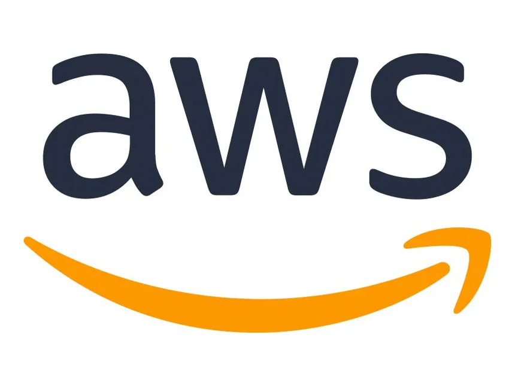
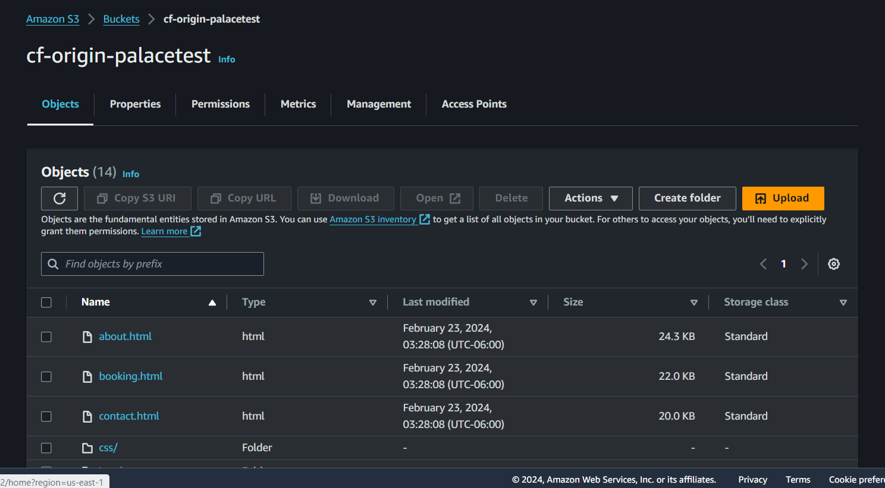
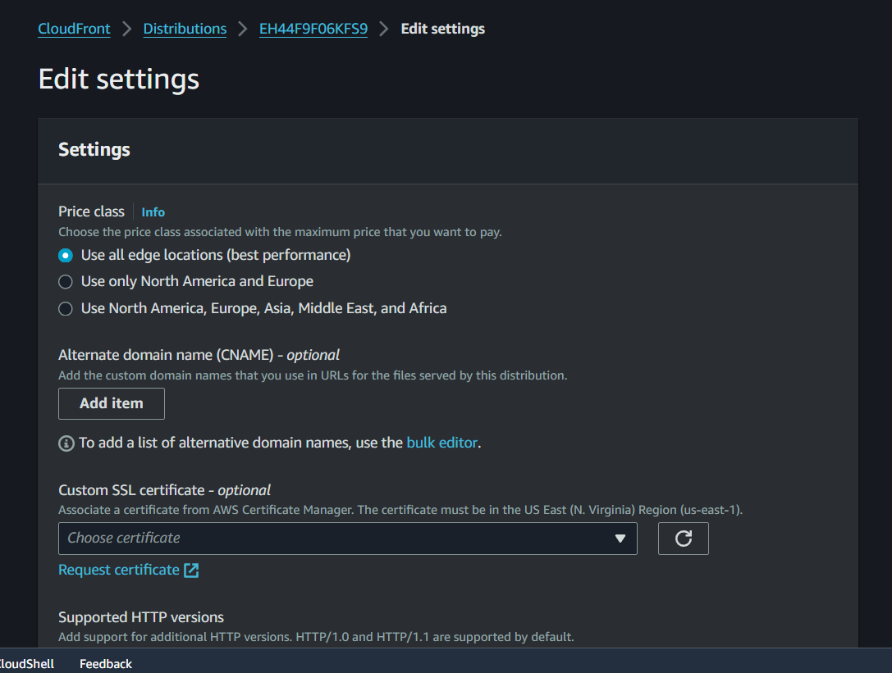
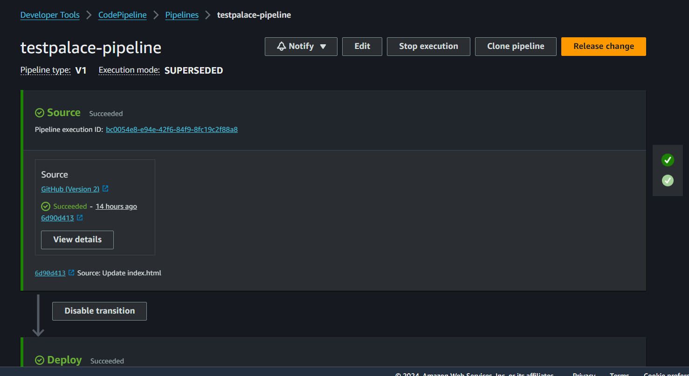
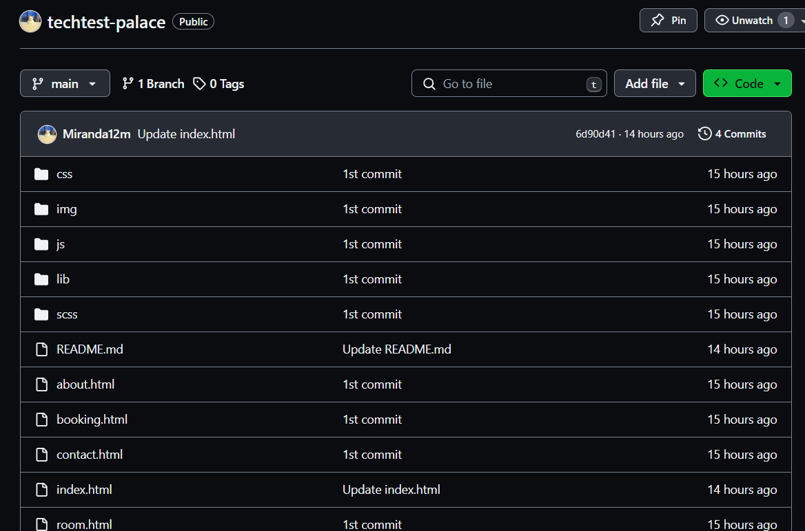
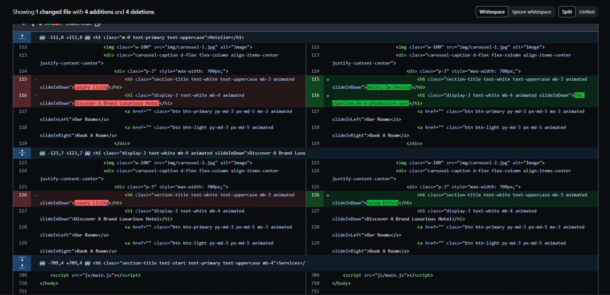
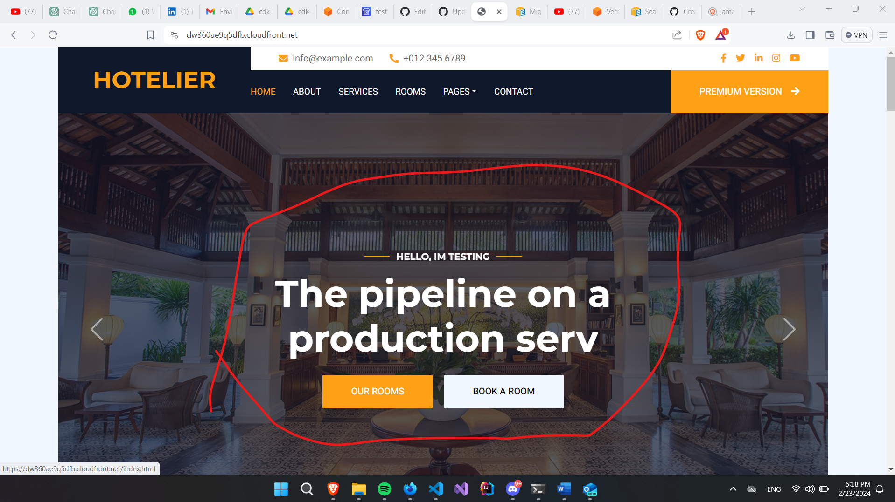

# Technical Interview Project AWS Console / AWS CDK by Tadeo Miranda

## Introduction
This documentation outlines the steps to deploy a static website using AWS services such as S3 buckets, CloudFront, and AWS CodePipeline. Here at the README section im going to share step by step the process using the AWS Console but on the cloudfront folder of this repo you can find the CDK project so you can check about the applications on AWS CDK infrastructure.



## 1. Setting up S3 Bucket and Upload the Files
Create an S3 Bucket ( my is 'cf-origin-palacetest')
- Navigate to the Amazon S3 console.
- Click on "Create bucket".
- Enter a unique bucket name (cf-origin-palacetest).
- Choose the appropriate region.
- Configure options and permissions as needed.
- Click "Create bucket".

Upload Files to S3 Bucket
- Navigate to the created S3 bucket.
- Click on "Upload".
- Select files from your local machine to upload.
- Default bucket config



## 2. Configuring CloudFront Distribution
Create a CloudFront Distribution
- Go to the CloudFront console.
- Click on "Create Distribution".
- Choose "Web" as the delivery method.
- In "Origin Settings", select the S3 bucket (cf-origin-palacetest) as the origin.
- Set the "Viewer Protocol Policy" to "Redirect HTTP to HTTPS".
- Set the "Default Root Object" to "index.html" (or your own default root object).
- Click "Create Distribution".



## 3. Updating Bucket Policy and Origin Access Identity
Set Up Origin Access Identity (OAI)
- Navigate to the CloudFront console.
- Select the origin associated with the S3 bucket.
- Click "Edit" and configure.
- Save changes.

Update Bucket Policy
- Go back to the Amazon S3 console.
- Select the bucket used for hosting the website (cf-origin-palacetest).
- Navigate to the "Permissions" tab.
- Click on "Bucket Policy".
- Paste the policy copied from the CloudFront distribution.
- Save changes.

```Json
{
    "Version": "2008-10-17",
    "Id": "PolicyForCloudFrontPrivateContent",
    "Statement": [
        {
            "Sid": "AllowCloudFrontServicePrincipal",
            "Effect": "Allow",
            "Principal": {
                "Service": "cloudfront.amazonaws.com"
            },
            "Action": "s3:GetObject",
            "Resource": "arn:aws:s3:::cf-origin-palacetest/*",
            "Condition": {
                "StringEquals": {
                    "AWS:SourceArn": "arn:aws:cloudfront::024846035239:distribution/EH44F9F06KFS9"
                }
            }
        }
    ]
}
```


Now our live enviorment is going to be working :D 

[Live Prod Server](https://dw360ae9q5dfb.cloudfront.net/)


## 4. Setting Up AWS CodePipeline
Create a Pipeline
- Go to the AWS CodePipeline console.
- Click on "Create pipeline".
- Enter a pipeline name and description.
- Configure source settings to connect to your GitHub repository.
- Configure deployment settings to deploy to the S3 bucket.
- Click "Create pipeline".



## 5. Deploying Changes via Pipeline
Commit Changes to GitHub Repo
- Make necessary changes to your GitHub repository.
- Commit changes to the desired branch.

Deployment to Production
- Once changes are committed, the CodePipeline will automatically trigger.
- Monitor the pipeline for successful deployment.
- Verify changes on the live website running on CloudFront.

[Project Repository](https://github.com/Miranda12m/techtest-palace)


## Time for the Functional testing 
Now Im going to commit some changes to my main branch to check if is running n the prod enviorment

[Dumb Commit test](https://github.com/Miranda12m/techtest-palace/commit/6d90d413e9dc2d9b68153831ec2e00e325506287)




[Live Prod Server](https://dw360ae9q5dfb.cloudfront.net/)



Yes, is working on live prod

## 5. Conclusiom 
IS WORKING

